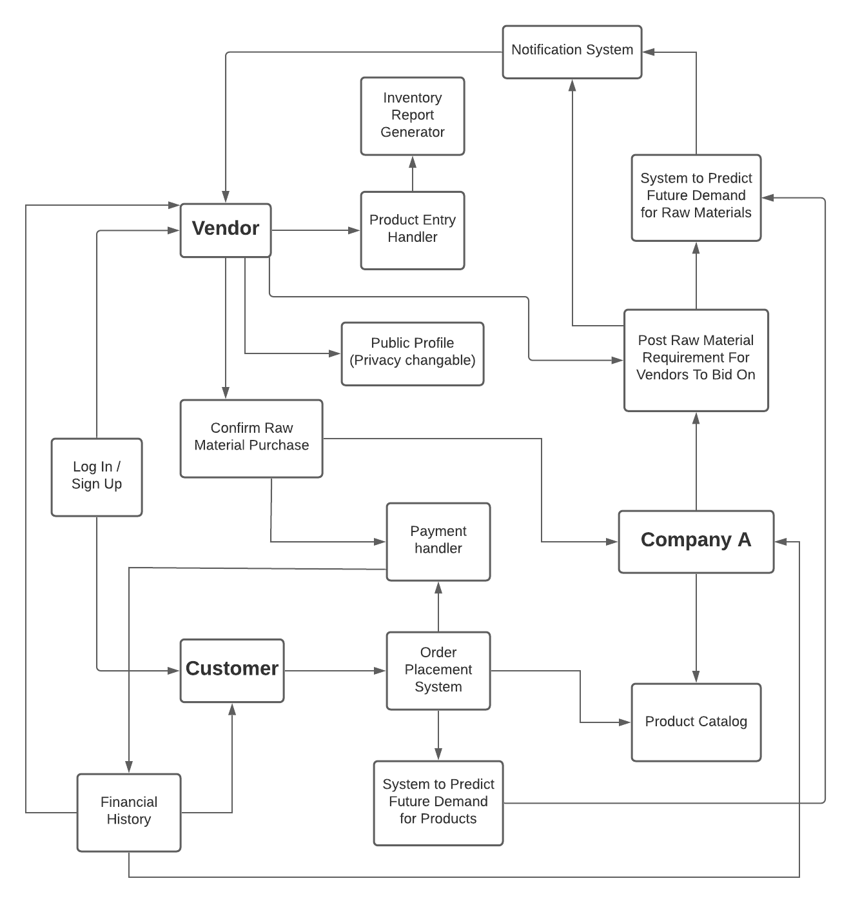
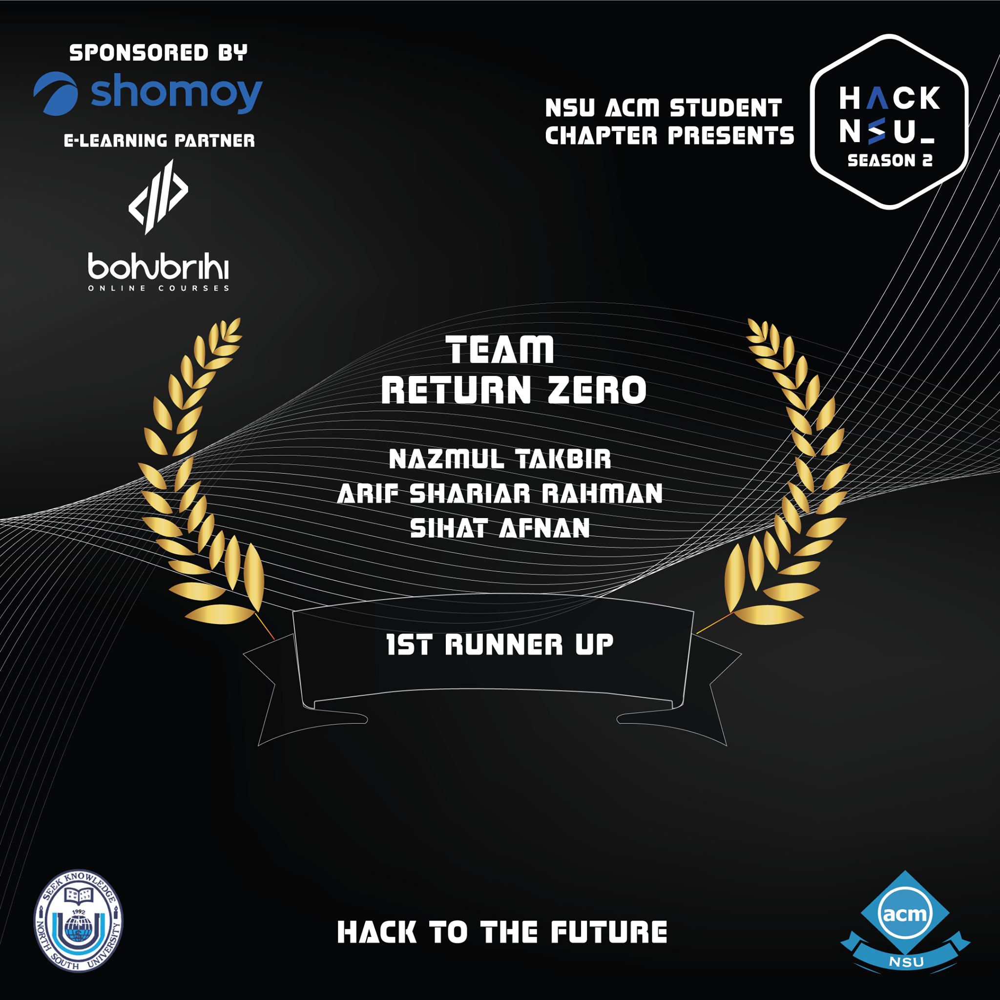

# HackNSU Season 2 Hackathon

### Hackathon hosted by NSU ACM Student Chapter

The problem statement of this hackathon was to automate the daily transactions of a leading garment product manufacturing company in such a way that would benefit the company as well the vendors and customers associated with it. 

--- 

### Technologies Used
* Framework: Django
* Database: Sqlite3

---

### Running the Project
* Download or clone this repository in your local system
* In command prompt or terminal, type and run "pip install -r requirements.txt" 
* After installing necessary libraries, run "py manage.py runserver"
* If you want administrator access:
    * user name : return_zero
    * password : 201705xxx
* If you want to log in as customer/vendor: 
    * Copy corresponding email from admin panel. 
    * Password is testpass1234.

---
 
### Problem Statement 

### Solution Summary

* Download [this](https://github.com/NazmulTakbir/HackNsu2_TEAM_RETURN_ZERO/blob/master/Solution%20Idea%20Summary.pptx) power point presentation

### Project Presentation 
* https://youtu.be/PLesnHNWkdc
---

### System Architecture: 

---

### Team Return Zero Members: 
* [Nazmul Takbir](https://github.com/NazmulTakbir)
* [Sihat Afnan](https://github.com/AfnanCSE98)
* [Arif Shariar Rahman](https://github.com/1705095)

---

### Hackathon Result:
* Team Return Zero was judged to be the first runner up

